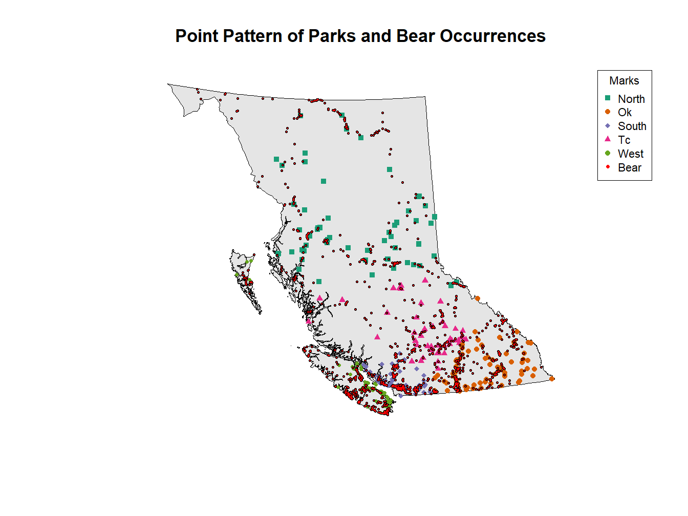

# 589 Species Spatial Exploratory Analysis

## American Black Bears (***Ursus-americanus-pallas***)  

### Group Members: Craig Adlam, Kulaphong Jitareerat, Nijiati Abulizi  

Contents of the `data` directory:

`589-Project-Group_2-Final_Version.Rmd` code file  
- includes R markdown of the entire code with headings and notes  
- will execute from its current location  
- some commented out sections for different visuals/comparisons when necessary

`BC_Parks.Rda` file is from last year (2022 cohort)  
- useful because it utilizes proj4string (proj args) whereas 2023 file does not  
- window should be similar to BC_Covariates.Rda (also uses proj args)  
- only includes `Elevation` and `Forest` covariates

`occurrence.txt` file contains the information necessary for analysis  
- this contains all the occurrences for the american black bear; has been copied out of the unzipped folder for analysis

`BC_Covariates.Rda` file contains the four covariates being used in this analysis  
- level of elevation (m), forest coverage (%), human footprint index (HFI), distance from water (m)

`Ursus-americanus-pallas.zip` full zipped file of the data

`Ursus-americanus-pallas` unzipped file of the data that includes `occurrences.txt` file

`img` directory contains all the images used in the report  

In-depth spatial statistics are used to analyze and shed light on black bear habitat preferences and potential human-wildlife interactions (HWI). Ultimately, there are three preliminary questions of interest that can be explored using this dataset, which could help support and improve understanding of the final question about HWI concerns.

- Habitat Selection: Do black bears exhibit preferences for specific elevations and/or forest cover within their range in BC?  
- Human Footprint: Is there a correlation between the human footprint index (HFI) and black bear occurrences?  
- Water Proximity: Does the distance from water sources influence black bear distribution?  
- Park Locations: Is there a relationship between the spatial distribution of park locations and black bear occurrences? If so, is this relationship significant?  

Understanding these relationships is critical for informing conservation strategies for black bears in BC as well as helping structure guidelines for humans cohabitating in areas of high HWI occurrences. By analyzing these spatial patterns, we can gain valuable insights into how to maintain healthy black bear populations alongside a growing human presence.

